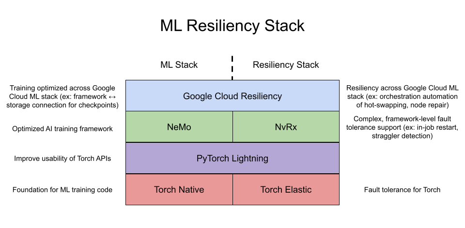

# Google Cloud Resiliency
## Table of content
- [Overview](#overview)
  - [Motivation](#motivation)
  - [Hierarchy of ML frameworks within this library](#hierarchy-of-ml-frameworks-within-this-library)
- [Resiliency Features](#resiliency-features)
  - [Optimized Checkpointing](#optimized-checkpointing)
  - [Holistic Cluster Control](#holistic-cluster-control)
- [Tools](#tools)
- [Usage](#usage)
- [Help](#help)

## Overview
The Resiliency library provides resilient training code used to improve training goodput (aka training efficiency) of distributed workloads. For those unfamiliar with the term "goodput", please read [Google Cloud Goodput Blogpost](https://cloud.google.com/blog/products/ai-machine-learning/goodput-metric-as-measure-of-ml-productivity). This library provides resilency features built on-top of [NVIDIA NeMo 2.0](https://github.com/NVIDIA/NeMo) training recipes. Reproducible benchmarks demonstrating high training goodput using this library are defined in [AI-Hypercomputer/gpu-recipes](https://github.com/AI-Hypercomputer/gpu-recipes).

### Motivation
The scale of large distributed AI training jobs results in frequent failures and interruptions. This library exists to help minimize the impact of failures and interruptions on training, ultimately improving training goodput for training workloads on Google Cloud.

### Hierarchy of ML frameworks within this library
This library intertwines several popular ML frameworks and adds features on top of them. The following diagram provides a visual representation of the ML resiliency stack and the benifits that come with each layer:



## Resiliency Features
The key features supported in the resiliency library focus on optimizing checkpointing and increasing resilience of the training infrastructure through holistic cluster control. The following sections will dive deeper into these two focus areas. Please note that some of these features are still experimental.

### Optimized Checkpointing
This library provides several checkpointing optimizations:

1) Emergency Checkpointing
2) Optimized Asynchronous Checkpointing
3) In-Cluster Checkpointing

Emergency Checkpointing is when a termininating workload can immediately save its current state before termination so that no training progress is lost. This functionality is defined in [`autocheckpoint.py`](resiliency/callbacks/autocheckpoint.py).

Optimized asynchronous checkpointing builds on-top of NeMo's asynchronous checkpointing functionality and utilizes several recent changes added to Torch Distributed Checkpointing. The changes supported here define a dedicated checkpointing subprocess that is long-living throughout the duration of the training job and is used to asynchronously write checkpoint state to file once checkpoint state is offloaded from CUDA to Host memory. This optimization also offloads checkpoint state as early as possible to minimize the duration in which training is blocked. This functionality is defined in [`persistent_ckpt_proc.py`](resiliency/plugins/persistent_ckpt_proc.py) and [`min_ckpt_overhead.py`](resiliency/plugins/min_ckpt_overhead.py). To enable optimized asynchronous checkpointing, please include training workload flag `--enable-optimized-async-ckpt`.

In-cluster checkpointing supports the ability for the workload to save and load checkpoints without a global persistent storage and is built on top of recent changes to Torch Distributed Checkpointing. Checkpointing within the cluster results in faster read and write times. When using in-cluster checkpointing, training code can save checkpoints more frequently, reducing the potential loss in training progress when the workload is interrupted. This functionality is defined in [`in_cluster_local_ckpt.py`](resiliency/plugins/in_cluster_local_ckpt.py) and [`replication_utils.py`](resiliency/plugins/replication_utils.py). There are separate flags for saving checkpoints to local and persistent storage. Setting `--local-ckpt-dir` and `--local-ckpt-interval` enable in-cluster checkpointing. Setting `--persistent-ckpt-dir` and `--persistent-ckpt-interval` enable checkpointing to persistent storage. A multi-tiered checkpointing solution should include checkpointing to both local and persistent storage, which is supported by enabling all 4 flags above related to local and persistent checkpoints.

### Holistic Cluster Control
Holistic cluster control is supported via the Supervisor. The supervisor comprises of three components based on control theory:
1) Sensor: Senses signals throughout the cluster and ingests them into the Controller
2) Controller: Defines logic in response to signals received from sensor.
3) Actuator: Applies logic to training cluster.

This library includes the client facing portion of the Supervisor in [`supervisor`](supervisor). One instance of the sensor, controller, and actuator should be deployed on CPU hosts per cluster. Each training host (GPUs) adjacent to the training workload should also run [`host_daemon.py`](supervisor/host_daemon.py) as a daemon deployment. The host daemon deployment on each host is responsible for monitoring the training processes on the same host and will relay all signal to the sensor deployment.

The Supervisor builds upon the resiliency support provided by [NVIDIA's NvRx library](https://github.com/NVIDIA/nvidia-resiliency-ext). In particular, it utilizes the heartbeating mechansisms defined in NvRx as a signal to whether each node is training as expected. When interruptions occur, the training job relies on the in-job restart support provided by NvRx.

Once the Supervisor is deployed, please include launcher flag `--use-supervisor` to attach the training job to the Supervisor.
## Tools
This library includes several tools to help with resiliency studies. 

1) **Goodput calculator**: [resiliency/goodput_measure](resiliency/goodput_measure/) includes tools to calculate training goodput. Please take a look at the [readme](resiliency/goodput_measure/README.md) for more information on how to use the goodput calculator.

2) **Failure simulator**: [simulator](simulator) provides an entrypoint script to simulate failures for the workload. To learn more about the script and its command line arguments, please run the following:
```python3 simulator/simulator_entrypoint.py --help```

## Usage
To use this library, we recommend using it directly out of Docker container `us-central1-docker.pkg.dev/deeplearning-images/reproducibility/pytorch-gpu-goodput:latest`, which includes all needed dependencies already installed. Our goodput training recipes defined [AI-Hypercomputer/gpu-recipes](https://github.com/AI-Hypercomputer/gpu-recipes) provide instructions for deploying the Supervisor and checkpoint optimization features on GKE.

If you want to use this library from scratch, please install it as a package via
```
pip install -e .
```

Within the docker container, use [`benchmark.py`](benchmark/benchmark.py) to run training utilizing the library's resiliency features. We recommend running the training script using the launcher in [`launcher.py`](third_party/nvidia-resiliency-ext/launcher.py).

The launch command from the root directory looks like the following:
```
python3 launcher.py \
  ${LAUNCHER_FLAGS} \
  benchmark/benchmark.py \
  ${WORKLOAD_FLAGS}
```
where `${LAUNCHER_FLAGS}` and `${WORKLOAD_FLAGS}` are all flags specific to the launcher and workload respectively.

For a complete list of launcher flags included in [`launcher.py`](third_party/nvidia-resiliency-ext/launcher.py), please run
```
python3 launcher.py --help
```

For a complete list of all flags included in [`benchmark.py`](benchmark/benchmark.py), please run
```
python3 benchmark/benchmark.py --help
```

## Help
If you run into any issues when using this library, please file an issue or create a pull request.